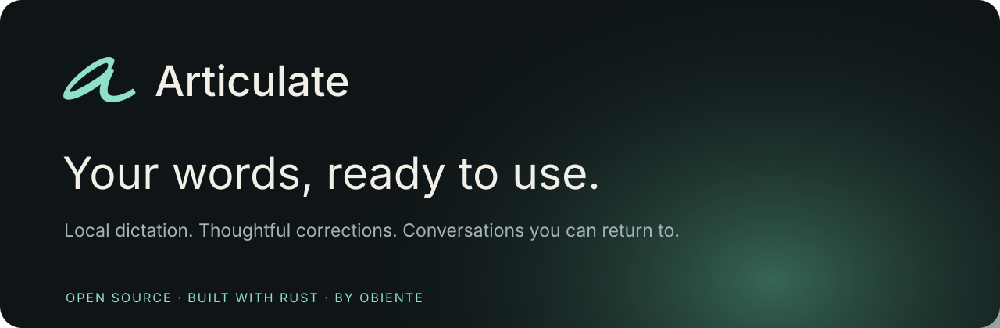

<a href="https://github.com/Obiente/articulate/releases/latest">Download for Windows</a> · <a href="docs/getting-started.md">Get started</a> · <a href="https://github.com/Obiente/articulate/issues">Feedback</a> · <a href="docs/development.md">Developer guide</a>

Articulate turns speech into text wherever you write, helps you remember conversations, and learns the spellings you correct. Recognition runs on your computer. No account, subscription, telemetry, or cloud transcription.

Built with Rust, Tauri, React and Mantine, with a local C/C++ inference runtime. Windows first, including CPU-only PCs.

## Make room for your voice

- **Dictate into your apps.** Hold a customizable shortcut to speak, or double-press for hands-free dictation. Toggle mode also supports live insertion in compatible text fields.
- **Polish a finished thought.** Optional local cleanup previews punctuation, grammar and repeated wording with Clear, Professional or Casual styling. Review changes before applying them; your original stays available.
- **Teach it your vocabulary.** Correct a short word or phrase, review the learning notice, and undo it if needed. Vocabulary can be scoped to an app or nearby words.
- **Say your shortcuts.** Say “bang signature” to expand a snippet, or use a template with a spoken `{text}` argument.
- **Keep the conversation.** Use Conversations to capture meetings from any app, with optional Discord participant tracks. Read speaker turns alongside an editable Notes document, with automatic local updates when the notes model is installed. Notetaker keeps your written and spoken notes together.
- **Find what matters.** Build [local notes](docs/local-summaries.md) from calls and dictations, then review and edit the document with expandable transcript sources. Search full saved transcripts and personal notes from the sidebar.
- **See your progress.** [Insights](docs/insights.md) shows retained dictation words, measured pace, vocabulary and cleanup changes, app usage and daily activity. Everything stays on this device.
- **Return to it later.** Local History keeps transcripts, originals, notes, and speaker names. Search, rename, copy, export, or delete a session.
- **Review context with Assort.** The included pretrained vocabulary classifier reviews saved spelling choices against the sentence and destination app. Choose **Review vocabulary** without configuring model paths, then review suggestions before applying them. Meeting notes use the separate local language model.

## Install

Download the **Windows x86_64 setup** from [Releases](https://github.com/Obiente/articulate/releases/latest). A portable ZIP is also available. The installer runs for your user without administrator access.

Open **Settings → Audio & models**. Qwen3-ASR 1.7B Q8_0 is a separate download of about **2.19 GB**. Calls can additionally use a **237 MB** acoustic speaker model when Discord activity is unavailable. These large speech models are not bundled; downloads are size- and SHA-256-verified before use. The small pretrained Assort vocabulary classifier is included in the application and works without a download or manual model setup.

An optional **751 MB Nemotron 3.5 ASR** download powers faster live dictation previews and adds a second local check for completed short dictations. Qwen still produces the final transcript. The check can replace a writing-system switch when the selected or independently detected language supports that correction; other disagreements keep Qwen's text. Live previews may omit brief fillers and are replaced by the final transcript. [Model comparison and current limits](docs/diarization-and-dual-asr.md).

For optional advanced cleanup, choose **Polish** after dictation or open **Settings > Audio & models > Advanced cleanup**. The Qwen3.5 0.8B Q8 editor and CPU tools download separately (about **852 MB**). Short passages run locally with explicit review. [Editing behavior and limits](docs/local-cleanup.md).

Assort's included models use authored synthetic English training examples. The vocabulary classifier scores existing spelling choices; they do not provide general language understanding or generate new prose. Review their suggestions, especially for unfamiliar names, ambiguous wording, and other languages. [How classification works →](docs/classification.md)

A recent Windows 10/11 PC with **16 GB RAM** is recommended as a starting point. CPU-only operation is supported; compatible Vulkan GPUs can accelerate inference. Performance depends on hardware and speech. A broader hardware compatibility matrix is still in progress.

Hold **Ctrl+Alt+Space** to dictate, then release to finish. Double-press for hands-free recording. Change the shortcut, activation mode, and recording sounds in Settings. [Full setup instructions →](docs/getting-started.md)

## Discord

The optional [Vencord companion](docs/vencord.md) sends current voice participants, avatar identifiers and speaking activity through a paired local connection. Articulate can prepare and update its custom Vencord build. The debugger-based connection remains available for the standard client.

The custom companion includes a [native receive adapter](plugins/discord-native/README.md) for separate participant audio by default. Its synthetic tests pass; real desktop-call validation is still pending. On unsupported clients, mixed output capture can use fresh Discord activity for names without acoustic classification, but cannot reliably separate overlapping voices. The interface distinguishes these audio sources. After pairing, Discord connects automatically; an optional setting starts and finishes transcripts on confirmed call joins and leaves. [Connection details →](docs/discord-integration.md)

## Updates and privacy

Articulate checks for a release on launch and once a day while open. Update notices appear throughout the workspace. Downloads remain your choice, are verified against the GitHub asset's SHA-256 digest, and install after recording has finished and pending history saves have completed. Models and saved sessions survive updates.

Speech runs locally after models are downloaded. Model downloads contact Hugging Face; app update checks and downloads contact GitHub. The Discord companion uses loopback. Participant pictures are fetched from Discord's CDN and cached locally. Text is never sent for transcription or correction. Saved text, notes, preferences and models live under `%LOCALAPPDATA%\TranscribeLocal`; audio is not saved. Uninstalling keeps this local data.

The initial Windows build is **unsigned**, so Windows may show an unknown-publisher warning. Obtain binaries from this repository's Releases page.

## Current limits

Recognition can make mistakes, particularly with noise, names, overlap, and short utterances. The optional second speech check is limited to short completed dictations and does not guarantee accuracy. Call text is revisable within bounded context windows; continuous speech still needs periodic commits. Generated notes need review against their transcript sources; longer conversations are summarized in sections and may contain decisions later amended elsewhere in the call. App insertion depends on Windows accessibility support. Native participant audio remains experimental. macOS, mobile keyboards and automatic sync are not yet implemented.

## Contribute

See [CONTRIBUTING.md](CONTRIBUTING.md) for local builds and checks, and [SECURITY.md](SECURITY.md) for private vulnerability reports. Please use synthetic or non-sensitive examples in public issues.

Tauri with React and Mantine is the only application interface built from this source. See the [desktop UI guide](docs/desktop-ui.md) for preview and build commands, available screens, and remaining feature migration work. Previously published releases are unchanged.

Articulate is licensed under **AGPL-3.0-or-later**, following [Obiente's open-source commitment](https://github.com/Obiente/.github/blob/main/profile/README.md). You may use, modify, and redistribute it under those terms; it comes without warranty. Included Assort weights carry their own model cards and license notices. Bundled fonts, icons, runtimes and Rust dependencies retain their own notices. Separately downloaded Qwen weights are Apache-2.0; Sortformer weights use the NVIDIA Open Model License; Nemotron 3.5 ASR weights use OpenMDW-1.1. See [LICENSE](LICENSE), [visual asset notices](assets/LICENSES.md), and the `licenses/` directory inside each binary distribution.
